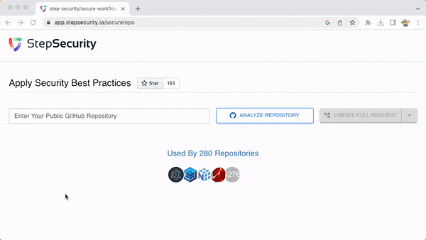
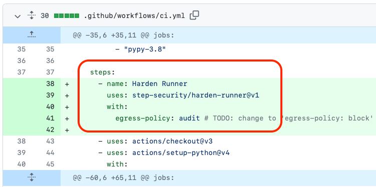
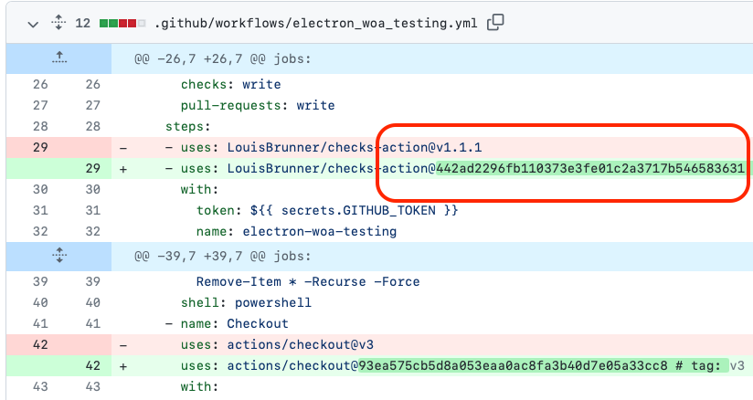
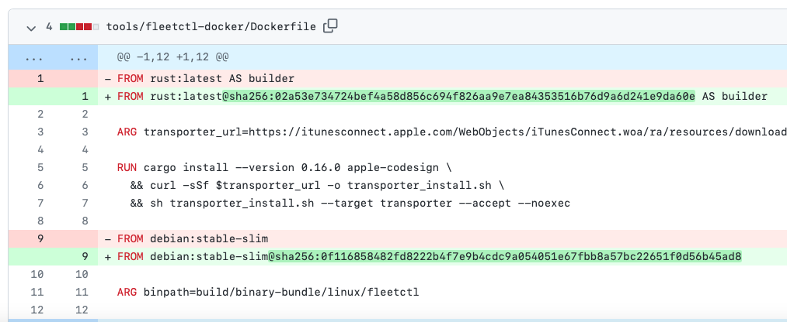

Automatically apply security best practices in your GitHub repository

  

<h3>
  <a href="#catalog-of-fixes">Catalog of Fixes</a> 
    • 
  <a href="#quickstart">Quickstart</a>
    • 
  <a href="#contributing">Contributing</a>  
</h3>

## Catalog of Fixes

1. [Automatically set minimum GITHUB_TOKEN permissions](#1-automatically-set-minimum-github_token-permissions)
2. [Add Harden-Runner GitHub Action to each job](#2-add-harden-runner-github-action-to-each-job)
3. [Pin Actions to a full length commit SHA](#3-pin-actions-to-a-full-length-commit-sha)
4. [Pin image tags to digests in Dockerfiles](#4-pin-image-tags-to-digests-in-dockerfiles)
5. [Add or update Dependabot configuration](#5-add-or-update-dependabot-configuration)
6. [Add CodeQL workflow (SAST)](#6-add-codeql-workflow-sast)
7. [Add Dependency review workflow](#7-add-dependency-review-workflow)
8. [Add OpenSSF Scorecard workflow](#8-add-openssf-scorecard-workflow)

### 1. Automatically set minimum GITHUB_TOKEN permissions

#### Why is this needed?

- The GITHUB_TOKEN is an automatically generated secret to make authenticated calls to the GitHub API
- If the token is compromised, it can be abused to compromise your environment (e.g., to overwrite releases or source code). This compromise will also impact everyone using your software in their supply chain.
- To limit the damage, [GitHub recommends setting minimum token permissions for the GITHUB_TOKEN](https://github.blog/changelog/2021-04-20-github-actions-control-permissions-for-github_token/).

#### Before and After the fix

**Pull request example**: https://github.com/nginxinc/kubernetes-ingress/pull/3134

In this pull request, minimum permissions are set automatically for the GITHUB_TOKEN

#### How does Secure-Repo fix this issue?

- Secure-Repo stores the permissions needed by different GitHub Actions in a [knowledge base](<(https://github.com/step-security/secure-repo/tree/main/knowledge-base/actions)>)
- It looks up the permissions needed by each Action in your workflow and sums the permissions up to come up with a final recommendation
- If you are the owner of a GitHub Action, please [contribute to the knowledge base](https://github.com/step-security/secure-repo/blob/main/knowledge-base/actions/README.md)

### 2. Add Harden-Runner GitHub Action to each job

#### Why is this needed?

[Harden-Runner GitHub Action](https://github.com/step-security/harden-runner) installs a security agent on the Github-hosted runner to prevent exfiltration of credentials, monitor the build process, and detect compromised dependencies.

#### Before and After the fix

**Pull request example**: https://github.com/python-attrs/attrs/pull/1034

This pull request adds the Harden Runner GitHub Action to the workflow file.

#### How does Secure-Repo fix this issue?

Secure-Repo updates the YAML file and adds [Harden-Runner GitHub Action](https://github.com/step-security/harden-runner) as the first step to each job.

### 3. Pin Actions to a full length commit SHA

#### Why is this needed?

- GitHub Action tags and Docker tags are mutable, which poses a security risk
- If the tag changes you will not have a chance to review the change before it gets used
- GitHub's Security Hardening for GitHub Actions guide [recommends pinning actions to full length commit for third party actions](https://docs.github.com/en/actions/security-guides/security-hardening-for-github-actions#using-third-party-actions).

#### Before and After the fix

Before the fix, your workflow may look like this (use of `v1` and `latest` tags)

After the fix, Secure-Repo pins each Action and docker image to an immutable checksum.

**Pull request example**: https://github.com/electron/electron/pull/36343

In this pull request, the workflow file has the GitHub Actions tags pinned automatically to their full-length commit SHA.

#### How does Secure-Repo fix this issue?

- Secure-Repo automates the process of getting the commit SHA for each mutable Action version or Docker image tag
- It does this by using GitHub and Docker registry APIs

### 4. Pin image tags to digests in Dockerfiles

#### Why is this needed?

- Docker tags are mutable, so use digests in place of tags when pulling images
- If the tag changes you will not have a chance to review the change before it gets used
- OpenSSF Scorecard [recommends pinning image tags for Dockerfiles used in building and releasing your project](https://github.com/ossf/scorecard/blob/main/docs/checks.md#pinned-dependencies).

#### Before and After the fix

Before the fix, your Dockerfile uses image:tag, e.g. `rust:latest`

After the fix, Secure-Repo pins each docker image to an immutable checksum, e.g. `rust:latest@sha256:02a53e734724bef4a58d856c694f826aa9e7ea84353516b76d9a6d241e9da60e`.

**Pull request example**: https://github.com/fleetdm/fleet/pull/10205

In this pull request, the Docker file has tags pinned automatically to their checksum.

#### How does Secure-Repo fix this issue?

- Secure-Repo automates the process of getting the checksum for each Docker image tag
- It does this by using Docker registry APIs

### 5. Add or update Dependabot configuration

#### Why is this needed?

- You enable Dependabot version updates by checking a `dependabot.yml` configuration file into your repository
- Dependabot ensures that your repository automatically keeps up with the latest releases of the packages and applications it depends on

#### Before and After the fix

Before the fix, you might not have a `dependabot.yml` file or it might not cover all ecosystems used in your project.

After the fix, the `dependabot.yml` file is added or updated with configuration for all package ecosystems used in your project.

**Pull request example**: https://github.com/muir/libschema/pull/31

This pull request updates the Dependabot configuration.

#### How does Secure-Repo fix this issue?

Secure-Repo updates the `dependabot.yml` file to add missing ecosystems. For example, if the Dependabot configuration updates npm packages but not GitHub Actions, it is updated to add the GitHub Actions ecosystem.

### 6. Add CodeQL workflow (SAST)

#### Why is this needed?

- Using Static Application Security Testing (SAST) tools can prevent known classes of bugs from being introduced in the codebase

#### Before and After the fix

Before the fix, you do not have a CodeQL workflow.

After the fix, a `codeql.yml` GitHub Actions workflow gets added to your project.

**Pull request example**: https://github.com/rubygems/rubygems.org/pull/3314

This pull request adds CodeQL to the list of workflows.

#### How does Secure-Repo fix this issue?

Secure-Repo has a [workflow-templates](https://github.com/step-security/secure-repo/tree/main/workflow-templates) folder. This folder has the default CodeQL workflow, which gets added as part of the pull request. The placeholder for languages in the template gets replaced with languages for your GitHub repository.

### 7. Add Dependency review workflow

#### Why is this needed?

- The Dependency review workflow scans for vulnerable versions of dependencies introduced by package version changes in pull requests, and warns you about the associated security vulnerabilities.
- This gives you better visibility of what's changing in a pull request, and helps prevent vulnerabilities being added to your repository.

#### Before and After the fix

Before the fix, you do not have a dependency review workflow.

After the fix, a `depdendency-review.yml` GitHub Actions workflow gets added to your project.

**Pull request example**: https://github.com/input-output-hk/catalyst-core/pull/286

This pull request adds GitHub's `actions/dependency-review-action` workflow to the list of workflows.

#### How does Secure-Repo fix this issue?

Secure-Repo has a [workflow-templates](https://github.com/step-security/secure-repo/tree/main/workflow-templates) folder. This folder has the default dependency review workflow, which gets added as part of the pull request.

### 8. Add OpenSSF Scorecard workflow

#### Why is this needed?

- OpenSSF Scorecard is an automated tool that assesses a number of important heuristics ("checks") associated with software security and assigns each check a score of 0-10.
- You can use these scores to understand specific areas to improve in order to strengthen the security posture of your project.

#### Before and After the fix

Before the fix, you do not have a OpenSSF Scorecard workflow.

After the fix, a `scorecards.yml` GitHub Actions workflow gets added to your project.

**Pull request example**: https://github.com/microsoft/CLRInstrumentationEngine/pull/527

This pull request adds OpenSSF Scorecard to the list of workflows.

#### How does Secure-Repo fix this issue?

Secure-Repo has a [workflow-templates](https://github.com/step-security/secure-repo/tree/main/workflow-templates) folder. This folder has the default Scorecard workflow, which gets added as part of the pull request.

## Quickstart

### Hosted Instance: [app.stepsecurity.io/securerepo](https://app.stepsecurity.io/securerepo)

To secure your GitHub repo using a pull request:

- Go to https://app.stepsecurity.io/securerepo and enter your public GitHub repository
- Log in using your GitHub Account (no need to install any App or grant `write` access)
- View recommendations and click `Create pull request.` Here is an example pull request: https://github.com/electron/electron/pull/36343.

### Integration with OpenSSF Scorecard

- Add [OpenSSF Scorecards](https://github.com/ossf/scorecard-action) starter workflow
- View the Scorecard results in GitHub Code Scanning UI
- Follow the remediation tip that points to https://app.stepsecurity.io

  

### Self Hosted

To create an instance of Secure Workflows, deploy _cloudformation/ecr.yml_ and _cloudformation/resources.yml_ CloudFormation templates in your AWS account. You can take a look at _.github/workflows/release.yml_ for reference.

## Contributing

Contributions are welcome!

If you are the owner of a GitHub Action, please contribute information about the use of GITHUB_TOKEN for your Action. This will enable the community to automatically calculate minimum token permissions for the GITHUB_TOKEN for their workflows. Check out the [Contributing Guide](https://github.com/step-security/secure-repo/blob/main/knowledge-base/actions/README.md)
